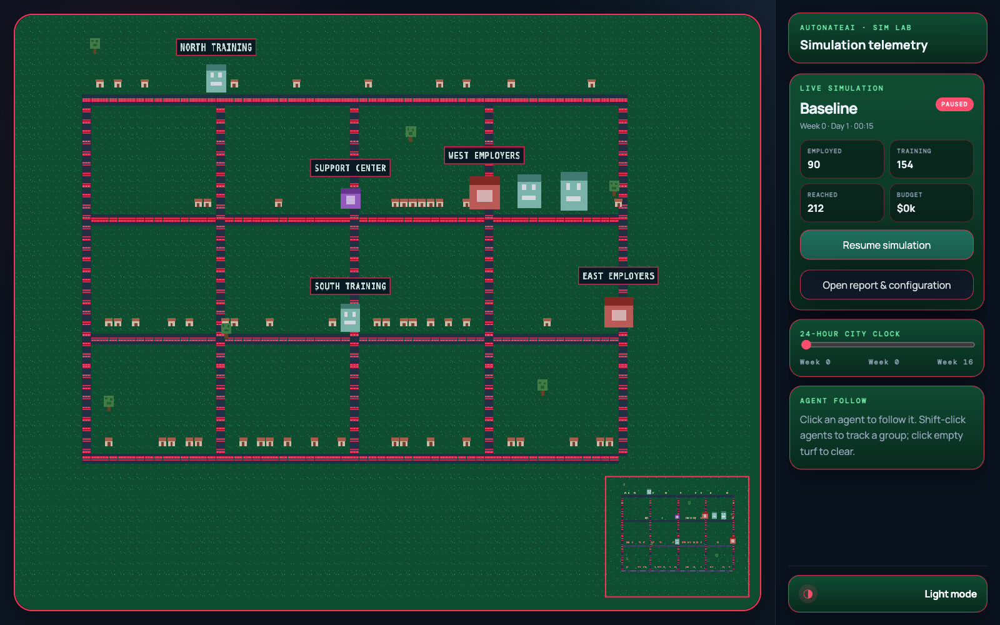

# Research Cockpit and World Roadmap

Sim Lab is not only a collection of simulations. It is a repeatable research workflow for turning an idea into an inspectable world, evidence, and a publishable explanation.



## The operating loop

```text
Idea → ODD → Mesa model → run artifacts → Phaser replay
     → observation → screenshots and notes → report → Docusaurus and PDF
```

Mesa remains the source of truth. The internal dashboard reads checked-in run artifacts; it does not reproduce model logic in the browser. The board makes state transitions observable, while the report connects those movements to metrics, narrative beats, constraints, and configuration.

Codex is the research teammate across that loop. It can help scaffold a simulation contract, implement and test model behavior, build a board for the domain, capture reproducible evidence, and assemble the resulting documentation. Human judgment remains responsible for assumptions, interpretation, and any claim about the real world.

## What the cockpit supports now

- Replay a 16-week Mesa run without replacing the model engine.
- Advance through a 24-hour clock with hourly positions, daily schedules, and changing ambient light.
- Place seeded homes on a shared street grid and route residents to support, education, and business destinations.
- Constrain travel to roads with varied walking, biking, and driving speeds plus deterministic lane separation.
- Pan and zoom from a whole-system view into local behavior.
- Follow one agent or Shift-click a group and keep them framed as they move.
- Pause, scrub the timeline, inspect vital metrics, and compare reproducible scenarios.
- Open a full report with the current configuration, bottleneck inference, metric trajectories, narrative beats, and agent pressures.
- Switch between a sage light world and the default green, navy, and neon-red dark world.

The dashboard is an internal study surface. Docusaurus is the public learning library. Insights should move from the cockpit into tutorials only after the run configuration and evidence are saved.

## World-building roadmap

The next layer is a reusable set of Codex skills and data contracts for constructing simulation worlds instead of hand-authoring every board.

### Board design

A board skill should translate the ODD and domain layout into tiles, roads, buildings, destinations, collision boundaries, and named observation zones. Board elements need stable identifiers so events can say where behavior occurred and reports can link a finding back to a place.

### Homes and daily origins

Agents should begin at persistent homes or other domain-specific origins. A home can carry neighborhood context, household pressure, travel access, and proximity to services. Starting locations make travel costs and geographic inequities part of the model rather than visual decoration.

### Mobility and speed

Travel should become an explicit model contract. Walking, biking, transit, and driving need different speeds, costs, access requirements, and reliability. Investments can then create observable capabilities—such as faster travel or broader access—while constraints can remove or degrade them.

### Physics and interaction

Reusable world logic should cover paths, collisions, queues, capacity, entrances, service time, and interaction radius. The visual physics must remain downstream of Mesa state unless the simulation contract explicitly makes spatial physics part of the truth engine.

### Research capture

The cockpit will gain structured notes, bookmarks, screenshots, and short recordings tied to a run, week, agent, and camera position. Codex can use those observations with saved artifacts to draft a report, but every generated claim should retain its run ID and evidence trail.

## Scaling rules

Every simulation must remain:

- **Discoverable:** a manifest, registry entry, industry category, tags, and stable ID.
- **Reproducible:** explicit configuration, seed, engine version, and complete run artifacts.
- **Publishable:** an ODD, code notes, tutorial, evidence assets, and export path.

The board can become richer over time, but it must never hide which engine produced the state, which assumptions were changed, or which evidence supports the report.
