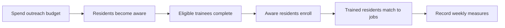

# ODD protocol

ODD means **Overview, Design concepts, and Details**. It is a standard way to describe an agent-based model precisely enough for another person to inspect or reproduce it.

## 1. Overview

### Purpose

Explore how a workforce program's budget, outreach, training capacity, and employer demand interact over a 16-week period. The primary question is not “What exact result will this city get?” but “Where does this opportunity pipeline become constrained?”

### Entities, state variables, and scales

The model contains 240 resident agents. Each resident has:

- a pipeline state: `unaware`, `aware`, `training`, `trained`, or `employed`;
- a fixed job-skill fit from 0.55 to 1.0;
- an optional training-start week.

The program environment has a remaining budget, concurrent training-seat limit, and remaining job openings. One time step represents one week. A run lasts 16 weeks.

### Process overview and scheduling

Each simulated week runs in this order:

The order matters. A resident reached this week may enroll this week, but training takes three weeks before completion and employment matching.

## 2. Design concepts

### Basic principles

The model represents an opportunity as a pipeline, not a listing. Public funding only produces employment when information, training capacity, completion, skills, and openings align.

### Emergence

Employment totals emerge from individual transitions and shared constraints. They are not calculated as a fixed percentage of the budget.

### Adaptation and objectives

Residents do not optimize across programs in version 1. They respond probabilistically when aware, enroll when capacity and funding exist, and accept a match when skill fit produces a successful draw.

### Interaction

Awareness creates a modest network effect: the more residents who already know about the program, the more effective outreach becomes. Resident agents do not yet have an explicit social graph.

### Stochasticity

Awareness, enrollment, completion, job matching, and initialization use independent seeded pseudorandom streams. Seed 42 is fixed in the interface, so identical inputs reproduce identical results. The separate streams also prevent a downstream change, such as employer openings, from altering upstream completion through random-number consumption.

### Observation

The interface reports residents reached, training completions, employment, remaining budget, and weekly state trajectories.

## 3. Details

### Initialization

Five percent of residents begin aware of the program. All others begin unaware. Skill fit is sampled uniformly from 0.55–1.0. The default program begins with $600,000, 36 concurrent training seats, and 90 openings.

### Input data

Version 1 uses synthetic inputs and is executed with Mesa 3.5.1. No claim is made that the defaults describe a specific city. A calibrated version should source program cost, funnel conversion, completion, placement, and retention data.

### Submodels

1. **Outreach:** spend a fixed weekly base plus a variable amount; unaware residents receive a seeded awareness draw.
2. **Completion:** residents finish after three weeks with a 92% completion probability; others return to aware status.
3. **Enrollment:** aware residents have a 24% weekly application/enrollment probability while seats and $3,500 per-resident funding remain.
4. **Matching:** trained residents have a weekly probability of `0.28 × skillFit` while openings remain.

## Known limitations

- Residents have no geography, demographics, transportation constraints, caregiving load, or income.
- Jobs are homogeneous except for resident skill fit.
- The model stops at placement and does not model wages or retention.
- Outreach channels and trust are compressed into one rate.
- Program staffing and administrative capacity are not separate constraints.

These omissions are the extension roadmap, not hidden assumptions.
