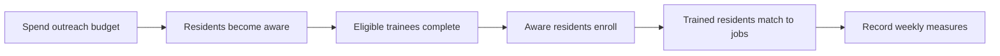

# ODD protocol

ODD means **Overview, Design concepts, and Details**. It is a standard way to describe an agent-based model precisely enough for another person to inspect or reproduce it.

## 1. Overview

### Purpose

Explore how a workforce program's budget, outreach, training capacity, and employer demand interact over a 16-week period. The primary question is not “What exact result will this city get?” but “Where does this opportunity pipeline become constrained?”

### Entities, state variables, and scales

The model contains 240 resident agents. Each resident has:

- a pipeline state: `unaware`, `aware`, `training`, `trained`, or `employed`;
- a fixed job-skill fit from 0.55 to 1.0;
- an optional training-start week.
- a seeded home attached to the street grid;
- a daily start hour, end hour, mobility mode, finite speed, destination, and orthogonal road route.
- a priority score, weekly time budget, commute duration, active-day count, action-time requirement, and time-access score.

The program environment has a remaining budget, concurrent training-seat limit, remaining job openings, residential streets, two education destinations, a support organization, and a business district. Pipeline decisions occur weekly. The checked-in clock records hourly positions across seven-day weeks, while the browser resolves movement in 15-minute steps between those observations.

### Process overview and scheduling

Each simulated week runs in this order:

The order matters. A resident reached this week may enroll this week, but training takes three weeks before completion and employment matching.

Within each week, every resident receives a seven-day itinerary containing sleep, preparation, work or school, workforce programming, food access, and optional community activity. Each off-site activity stores its own destination, route, and commute time. Residents follow those routes, stop at traffic signals, queue behind slower traffic, flash red when leaving a building, flash green when entering, and remain hidden while indoors.

## 2. Design concepts

### Basic principles

The model represents an opportunity as a pipeline, not a listing. Public funding only produces employment when information, training capacity, completion, skills, and openings align.

### Emergence

Employment totals emerge from individual transitions and shared constraints. They are not calculated as a fixed percentage of the budget.

### Adaptation and objectives

Residents do not optimize across multiple programs. They prioritize the current pipeline action using motivation, confidence, money pressure, family pressure, transportation pressure, and available contacts. Distance and mobility speed consume the weekly time budget, so closer residents can devote more time to the same action.

### Interaction

Awareness creates a modest network effect: the more residents who already know about the program, the more effective outreach becomes. Resident agents do not yet have an explicit social graph.

### Stochasticity

Awareness, enrollment, completion, job matching, and initialization use independent seeded pseudorandom streams. Seed 42 is fixed in the interface, so identical inputs reproduce identical results. The separate streams also prevent a downstream change, such as employer openings, from altering upstream completion through random-number consumption.

### Observation

The interface reports residents reached, training completions, employment, remaining budget, weekly state trajectories, and a 15-minute city clock. The replay exposes 15 named neighborhood zones, 32 institutions, homes, scheduled destinations, road-constrained movement, mobility modes, signal delays, queues, human needs, peer interactions, and restrained day/night lighting.

## 3. Details

### Initialization

Five percent of residents begin aware of the program. All others begin unaware. Skill fit is sampled uniformly from 0.55–1.0. The default program begins with $600,000, 36 concurrent training seats, and 90 openings.

### Input data

Version 3 is anchored to official Grand Rapids, Kent ISD, Census, BLS, education, workforce-provider, and employer-directory sources and is executed with Mesa 3.5.1. Institution presence, broad geography, occupation families, and demographic margins are source-backed; resident-level records, exact coordinates, capacities, schedules, behavioral coefficients, and outcomes remain synthetic modeling assumptions rather than parcel-accurate or person-level claims.

### Submodels

1. **Time access:** combine priority with available weekly hours divided by action and commute hours; clamp the multiplier from 0.20 to 1.15.
2. **Outreach:** spend a fixed weekly base plus a variable amount; unaware residents receive a seeded awareness draw multiplied by time access.
3. **Completion:** residents finish after three weeks with `0.92 × timeAccess`; others return to aware status.
4. **Enrollment:** aware residents receive `0.24 × timeAccess` while seats and $3,500 per-resident funding remain.
5. **Matching:** trained residents receive `0.28 × skillFit × timeAccess` while openings remain.

## Known limitations

- The city is a synthetic orthogonal street grid rather than calibrated GIS/GTFS geography.
- Signals, queues, and following gaps are deterministic visual traffic rules; they are not calibrated intersection-capacity or crash models.
- Demographics, income, and caregiving pressures are state variables but are not yet calibrated to local distributions.
- Jobs are homogeneous except for resident skill fit.
- The model stops at placement and does not model wages or retention.
- Outreach channels and trust are compressed into one rate.
- Program staffing and administrative capacity are not separate constraints.

These omissions are the extension roadmap, not hidden assumptions.
