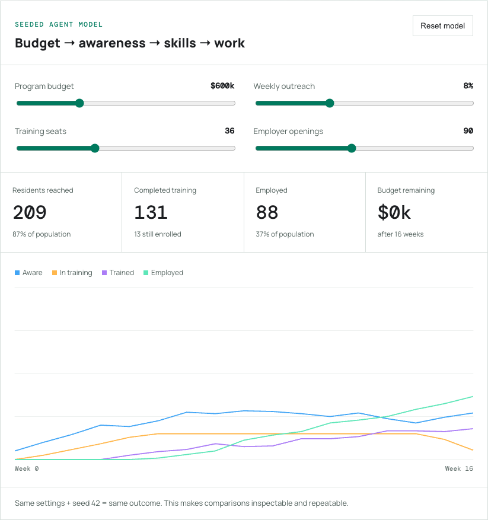
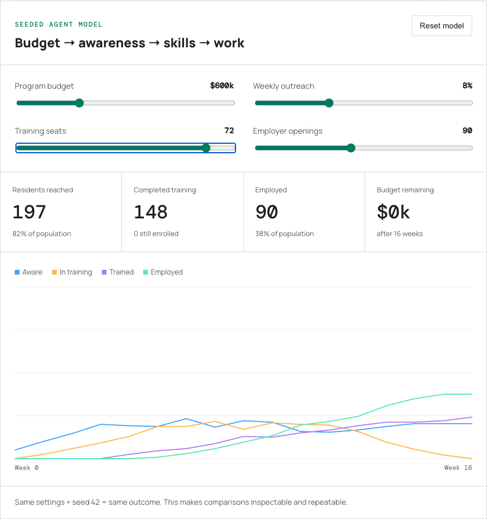

# Follow Along: Find the Workforce Pipeline Bottleneck

Workforce funding does not move straight into jobs. It passes through a chain of resident awareness, enrollment, completion, and employer demand. You will run three controlled experiments to find which part of that chain limits this model.

## The goal

Learn to change one assumption at a time, read the state trajectories, and distinguish a training-capacity problem from an employer-demand problem.

## 1. Establish the baseline

Open the [interactive model](./index.mdx) and select **Reset model**. The fixed seed means the baseline will be identical every time.

Record these four outputs:

| Measure | What it tells you |
| --- | --- |
| Residents reached | Whether information entered the community |
| Completed training | Whether capacity became skill |
| Employed | Whether trained residents found openings |
| Budget remaining | Whether money or another constraint stopped progress |

## 2. Test outreach

Move **Weekly outreach** from 8% to 16%. Leave every other control unchanged.

If awareness rises without a similar employment increase, outreach was not the final bottleneck. The additional residents still have to pass through finite training seats and job openings.

## 3. Test training capacity

Reset the model. Move **Training seats** from 36 to 72.

Watch the orange “In training” line and the purple “Trained” line. A seat is a concurrent slot, so one slot may serve multiple residents across the 16-week run after earlier trainees finish.

In this seeded run, doubling seats raised completed training from 131 to 148 while employment moved only from 88 to 90. Capacity produced more trained residents, but the 90 available openings became the next constraint.

## 4. Test employer demand

Keep 72 training seats and move **Employer openings** from 90 to 160. If employment barely changes, openings were already sufficient. If it rises, the earlier run was demand-constrained.

## 5. Make a defensible claim

Write your result in this form:

> In this synthetic run, changing **[one input]** from **[old value]** to **[new value]** changed **[one output]** from **[old result]** to **[new result]**, while the seed and other assumptions stayed fixed.

This wording separates model evidence from claims about a real city.

## Debug order

1. Confirm the seed and all four controls.
2. Reset before beginning a new comparison.
3. Change only one control.
4. Check whether budget reached zero.
5. Inspect awareness, training, trained, then employed—in that order.
6. Read the [ODD limitations](./odd.md#known-limitations) before generalizing.

## What you learned

You treated a public program as a connected system rather than a budget line. You also ran a controlled simulation experiment: one changed assumption, a fixed random seed, observable outputs, and a bounded conclusion.
