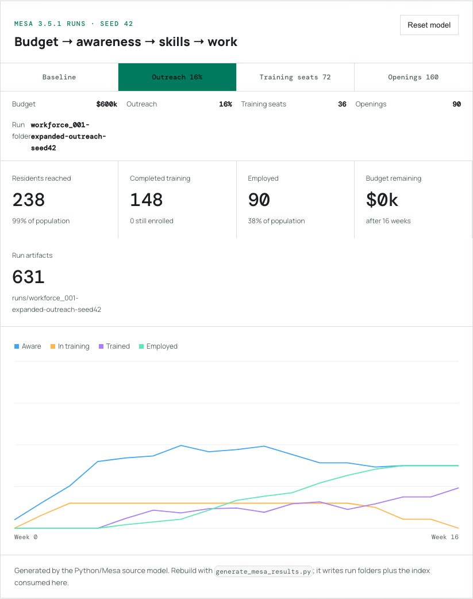
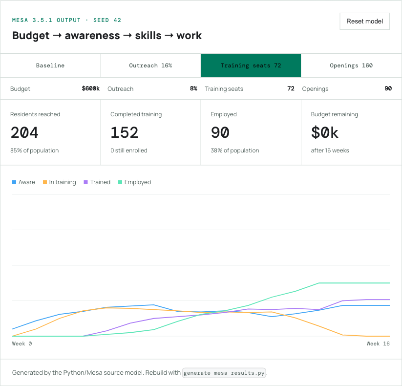
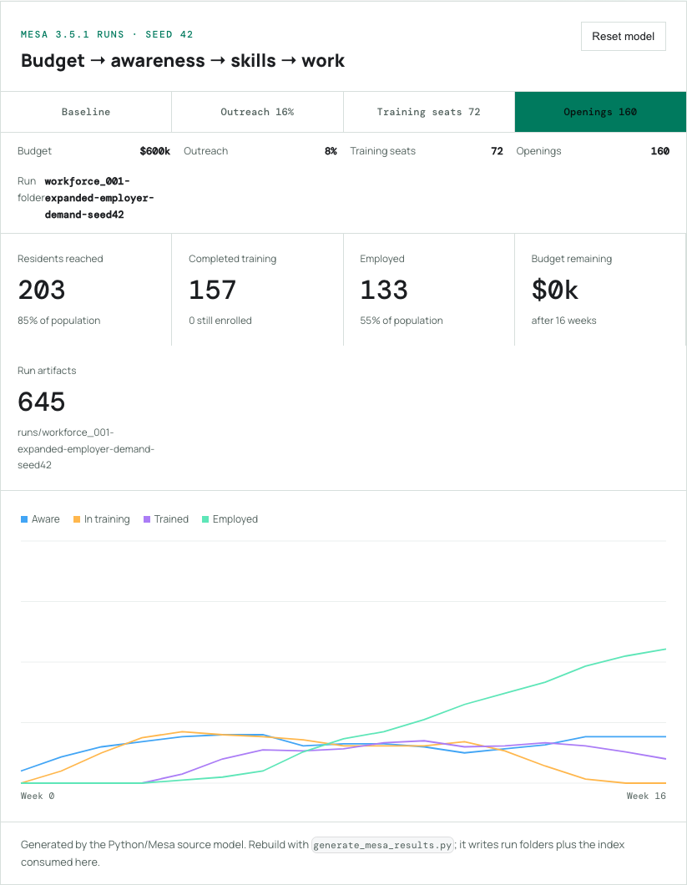

# Follow Along: Find the Workforce Pipeline Bottleneck

Workforce funding does not move straight into jobs. It passes through a chain of resident awareness, enrollment, completion, and employer demand. You will compare four runs generated by the Python/Mesa model to find which part of that chain limits outcomes.

The browser is visualizing checked-in Mesa 3.5.1 output. Each scenario button loads the full 16-week series collected by Mesa's `DataCollector`; it is not a JavaScript reimplementation of the model.

## The goal

Learn to change one assumption at a time, read the state trajectories, and distinguish a training-capacity problem from an employer-demand problem.

## 1. Establish the baseline

Open the [Mesa output viewer](./index.mdx) and select **Baseline** or **Reset model**. The fixed seed means the baseline will be identical every time.

Record these four outputs:

| Measure | What it tells you |
| --- | --- |
| Residents reached | Whether information entered the community |
| Completed training | Whether capacity became skill |
| Employed | Whether trained residents found openings |
| Budget remaining | Whether money or another constraint stopped progress |

## 2. Test outreach

Move **Weekly outreach** from 8% to 16%. Leave every other control unchanged.

Select **Outreach 16%** in the Mesa output viewer.

Residents reached increased from 212 to 236, while employment stayed at 90. Outreach reached nearly the entire population, but it was not the final bottleneck; residents still had to pass through finite training seats and job openings.

## 3. Test training capacity

Select **Training seats 72**. This run resets outreach to 8%, keeps openings at 90, and changes only concurrent training capacity.

Watch the orange “In training” line and the purple “Trained” line. A seat is a concurrent slot, so one slot may serve multiple residents across the 16-week run after earlier trainees finish.

Doubling seats raised completed training from 148 to 152 while employment stayed at 90. Capacity produced more trained residents, but the 90 available openings became the next constraint.

## 4. Test employer demand

Select **Openings 160**. This Mesa run keeps 72 training seats and changes employer openings from 90 to 160.

Employment rose from 90 to 124 while completed training remained exactly 152. That isolates employer demand as the binding constraint in the 72-seat run.

## 5. Make a defensible claim

Write your result in this form:

> In this synthetic run, changing **[one input]** from **[old value]** to **[new value]** changed **[one output]** from **[old result]** to **[new result]**, while the seed and other assumptions stayed fixed.

This wording separates model evidence from claims about a real city.

## Debug order

1. Confirm the seed and all four controls.
2. Reset before beginning a new comparison.
3. Change only one control.
4. Check whether budget reached zero.
5. Inspect awareness, training, trained, then employed—in that order.
6. Read the [ODD limitations](./odd.md#known-limitations) before generalizing.

## What you learned

You treated a public program as a connected system rather than a budget line. You also ran a controlled simulation experiment: one changed assumption, a fixed random seed, observable outputs, and a bounded conclusion.
